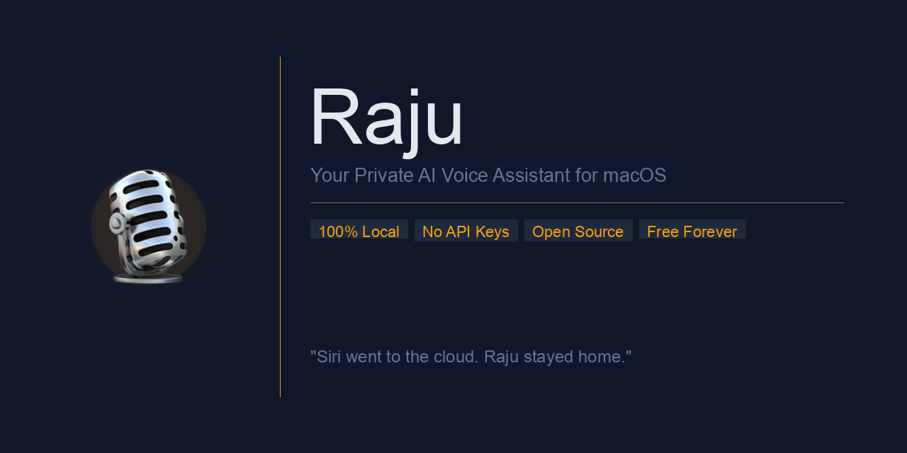
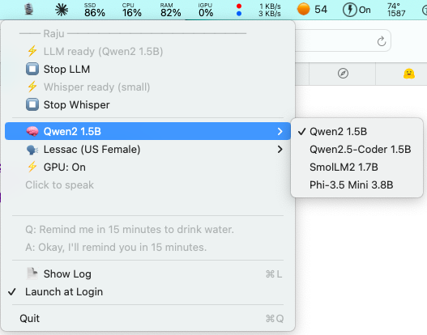
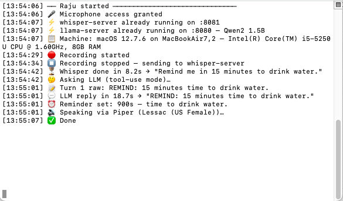

<p align="center">
  
</p>

Hold the menubar icon → speak → get a real answer. All on your machine. All private. No API keys, no subscriptions, no internet required after install.

| Menu | Live Log |
|:----:|:--------:|
|  |  |

**CI — Prompt Pass Rate (per model)**

| Model | Pass Rate |
|-------|-----------|
| Qwen2 1.5B | [](https://github.com/vvikas/raju/actions/workflows/llm-test.yml) |
| SmolLM2 1.7B | [](https://github.com/vvikas/raju/actions/workflows/llm-test.yml) |

---

## What makes it different

Siri is smart, but it phones home for everything. Raju runs a local LLM, a local speech-to-text engine, and a local neural voice synthesizer — entirely on your Mac. It doesn't just look things up, it actually runs bash commands against your live system to give you real answers.

| | Siri | Raju |
|---|---|---|
| Works offline | ❌ | ✅ |
| Privacy | Logs to Apple | Zero telemetry |
| Checks your real system | Limited | Full read-only shell access |
| Voices | Fixed | 6 neural voices, swap anytime |
| Models | Fixed | 4 LLMs, swap on the fly |
| Open source | ❌ | ✅ |
| Cost | Apple subscription | Free forever |

---

## How it works

```
Hold icon  →  rec              (mic → WAV)
Release    →  whisper-server   (WAV → text, runs locally)
              llama-server     (text + live system data → reply)
              Piper TTS        (reply → speech, runs locally)  →  speaker
```

All inference runs on persistent local HTTP servers — models stay loaded in RAM so each query after warm-up is fast.

---

## Features

- **Push-to-talk** — hold to record, release to respond
- **Live system queries** — CPU, RAM, disk, battery, network via a two-turn ReAct loop
- **4 LLMs** — switch models on the fly from the menu; new model downloads in-app (~1 GB)
- **6 Piper neural voices** — auto-downloads on first select (~60 MB each)
- **GPU toggle** — right-click → toggle Metal GPU acceleration on/off; auto-detected at first launch (Apple Silicon = on, Intel = off)
- **Intel Mac support** — fully functional on Intel; GPU disabled by default to avoid Metal compatibility issues
- **Stop / Start servers** — toggle LLM or Whisper from the menu without quitting
- **Live log** — streams in Terminal with `tail -f ~/Raju/raju.log`
- **Launch at Login** — one-click LaunchAgent toggle
- **Fully private** — zero network calls during operation

---

## Install

```bash
git clone https://github.com/vvikas/raju
cd raju
chmod +x install.sh
./install.sh
```

The installer handles everything end-to-end:

| Step | What it does |
|------|-------------|
| Homebrew | Installs if missing |
| sox | `brew install sox` — mic recording |
| llama.cpp | Clone + build from source (with Metal GPU acceleration) |
| whisper.cpp | Clone + build from source (with Metal GPU acceleration) |
| Whisper model | Downloads `ggml-small.bin` (~466 MB) |
| LLM model | Downloads Qwen2 1.5B (~940 MB) as the default |
| Piper TTS | `pip3 install piper-tts` + Lessac voice (~60 MB) |
| Compile | Builds `Raju.app` in `~/Applications` |

> First build takes 20–30 minutes (compiling llama.cpp + whisper.cpp from source).
>
> Additional models (Qwen2.5-Coder, SmolLM2, Phi-3.5 Mini) download on demand via the in-app menu — no need to fetch them upfront.

---

## Run

```bash
open ~/Applications/Raju.app
```

The 🎙️ icon appears in your menubar. Wait ~60 seconds for models to warm up — **⚡** appears next to both LLM and Whisper when ready.

> **First run:** launch from your own Terminal so macOS can grant microphone access. Approve the mic permission prompt when it appears.

---

## Usage

| Action | Effect |
|--------|--------|
| **Hold** 🎙️ | Start recording |
| **Release** | Stop → transcribe → think → speak |
| **Right-click** | Open menu |

### What you can ask

- **System Performance:** CPU usage, RAM usage, battery level, disk space, and uptime.
- **Process Management:** Find out if specific apps (like Spotify or Safari) are currently running.
- **Networking:** Find your current IP address and Wi-Fi network name.
- **File Search:** Locate the largest files on your Mac, find recently modified files, or search by filename.
- **Productivity:** "What's in my clipboard?", "Set a timer for 10 minutes."
- **General Knowledge:** Direct mathematical conversions or trivia answered securely offline.

---

## Models

Switch anytime via right-click → 🧠 Model. The old server stops and the new one starts automatically. Models marked ↓ download in-app on first select.

| Model | Size | Best for | Download |
|-------|------|----------|----------|
| Qwen2 1.5B | ~940 MB | General questions — default, pre-installed | install.sh |
| Qwen2.5-Coder 1.5B | ~950 MB | Code, scripting, technical questions | In-app ↓ |
| SmolLM2 1.7B | ~1.1 GB | Fast, capable all-rounder | In-app ↓ |
| Phi-3.5 Mini 3.8B | ~2.2 GB | Best reasoning quality | In-app ↓ |

---

## Voices

Switch anytime via right-click → 🗣 Voice. Voices auto-download on first select (~60 MB each).

| Voice | Accent | Download |
|-------|--------|----------|
| Lessac (US Female) | Default | install.sh |
| Ryan (US Male) | American | In-app ↓ |
| Amy (US Female) | American | In-app ↓ |
| Joe (US Male) | American | In-app ↓ |
| Jenny (GB Female) | British | In-app ↓ |
| Alan (GB Male) | British | In-app ↓ |

Falls back to macOS `say` if Piper is not installed.

---

## How the tool-use loop works

For system queries, Raju uses a two-turn ReAct loop:

**Turn 1** — LLM decides whether to answer directly or generate a shell command:
```xml
<bash>
ps -Axo pid,args,%cpu,%mem -r | head -15
</bash>
```

**Turn 2** — Raju runs the command, safely reads the output using a non-blocking stream to prevent truncation, feeds it back, and the LLM gives a spoken answer:
```
llama-server is using the most CPU at 66%, followed by Claude Helper at 28%.
```

The output reformatter converts raw columnar text (hard for small LLMs to parse) into labeled key=value pairs before Turn 2:
```
Processes sorted by CPU (highest first):
  pid=62840, name=llama-server, cpu=66.6%, ram=6.5%
  pid=42584, name=Claude Helper, cpu=28.7%, ram=6.9%
```

Commands are sandboxed — destructive operations (`rm`, `kill`, `sudo`, `curl`, etc.) are blocked. The LLM only gets read-only shell access.

---

## Requirements

- macOS 12+ (Apple Silicon and Intel — GPU auto-detected)
- Xcode Command Line Tools (`xcode-select --install`)
- ~6 GB free disk (models + compiled binaries)
- ~2 GB RAM headroom (4 GB recommended for Phi-3.5 Mini)

---

## Test Suite

Raju ships a Python test suite (`test_llm.py`) that measures how accurately a given LLM generates correct macOS bash commands for common user queries. GitHub Actions automatically runs the suite against **two models** on every push. After each run, the pass percentage is written to `ci-results/<model>.json` and the live badge at the top of this README updates automatically.

### How it works

1. The test script sends each user query to the local `llama-server` HTTP API using the same system prompt that the app uses.
2. It extracts the `<bash>...</bash>` block from the LLM's reply.
3. A purpose-written validator (not a keyword match — actual logic) checks whether the generated command would correctly fulfil the request on macOS.
4. Results are printed with ✅ / ❌ per test and a final score like **`82% (9/11)`**.
5. The CI job fails if the pass rate drops below **70%**.

**Badge colours:** 🟢 ≥ 80% · 🟡 60–79% · 🔴 < 60%

### Running locally

```bash
# Run with the currently loaded model (llama-server must be running on :8080)
python3 test_llm.py

# Label the output with a model name
python3 test_llm.py --model "Qwen2 1.5B"
```

### How to add a new test case

Open `test_llm.py` and append an entry to the `TEST_CASES` list:

```python
{
    "query": "how many cores does my CPU have?",
    "validator": lambda cmd: cmd and "sysctl" in cmd and "cpu" in cmd.lower()
},
```

The validator receives the exact bash command the LLM generated. Return `True` if the command is logically correct for macOS, `False` otherwise. Keep validators concise and focused — avoid hardcoding exact command strings.

### How to add a new model to CI

Open `.github/workflows/llm-test.yml` and add an entry to the `matrix.model` list:

```yaml
- name: "Phi-3.5 Mini"
  filename: "phi-3.5-mini-instruct-q4_k_m.gguf"
  url: "https://huggingface.co/.../phi-3.5-mini-instruct-q4_k_m.gguf"
```

GitHub Actions will then run a parallel job for the new model on every push, and a new badge row can be added to the table at the top of this README.

---

## File layout

```
~/Raju/                      ← this repo
├── main.swift               ← the AppDelegate 
├── Config.swift             ← global paths & config
├── ServerManager.swift      ← manages llama & whisper processes
├── LLMClient.swift          ← HTTP client & ReAct loop
├── ShellExecutor.swift      ← safe bash command runner
├── AudioRecorder.swift      ← mic input subprocess
├── TTSManager.swift         ← Piper speech synthesis
├── Models.swift             ← AI model configurations
├── install.sh               ← one-shot dependency installer
├── raju.log                 ← runtime log (gitignored)
```

---

## Dependencies

| Tool | Purpose |
|------|---------|
| [sox](https://sox.sourceforge.net) | Mic recording (`rec`) |
| [llama.cpp](https://github.com/ggerganov/llama.cpp) | LLM inference server |
| [whisper.cpp](https://github.com/ggerganov/whisper.cpp) | Speech-to-text server |
| [piper-tts](https://github.com/rhasspy/piper) | Neural text-to-speech |

---

## Privacy

Everything runs 100% locally. No data ever leaves your machine. No telemetry, no accounts, no subscriptions.

---

## Tested on

- MacBook Air M2, Apple Silicon, 8 GB RAM, macOS 14.x
- MacBook Air 2015, Intel Core i5, 8 GB RAM, macOS 12.7
