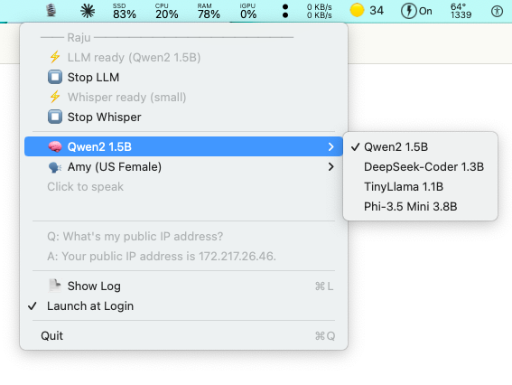

# Raju — Local Voice Assistant for macOS

> **Hold** the menubar icon to speak. **Release** to get a reply.
> 100% on-device — no cloud, no API keys, no internet required after install.



---

## What it does

Raju is a fully local voice assistant that lives in your macOS menubar. Ask it anything — system stats, battery, disk space, IP address, time — and it answers out loud in a natural voice.

```
Hold icon  →  rec        (mic → WAV)
Release    →  whisper-server  (WAV → text)
              llama-server    (text + live system data → reply)
              Piper TTS       (reply → speech)  →  speaker
```

All inference runs on persistent local HTTP servers — models stay loaded in RAM so each query after warm-up is fast.

---

## Features

- **Push-to-talk** — hold to record, release to respond
- **Live system queries** — CPU, RAM, disk, battery, network via a tool-use ReAct loop
- **4 LLMs built-in** — switch models on the fly, server restarts automatically
- **6 Piper neural voices** — auto-downloads on first select (~60 MB each)
- **Stop / Start servers** — toggle LLM or Whisper from the menu without quitting
- **Live log** — streams in Terminal with `tail -f`
- **Launch at Login** — one-click LaunchAgent toggle
- **Fully private** — zero network calls during operation

---

## Install

```bash
git clone https://github.com/vvikas/raju
cd raju
chmod +x install.sh
./install.sh
```

The installer handles everything end-to-end:

| Step | What it does |
|------|-------------|
| Homebrew | Installs if missing |
| sox | `brew install sox` — mic recording |
| llama.cpp | Clone + build from source |
| whisper.cpp | Clone + build from source |
| Whisper model | Downloads `ggml-small.bin` (~466 MB) |
| LLM models | Downloads Qwen2 1.5B, DeepSeek-Coder 1.3B, TinyLlama 1.1B |
| Piper TTS | `pip3 install piper-tts` + Lessac voice (~60 MB) |
| Compile | Builds the `Raju` binary |

> First build takes 20–30 minutes (compiling llama.cpp + whisper.cpp from source).

---

## Run

```bash
~/Raju/Raju
```

The 🎙️ icon appears in your menubar. Wait ~60 seconds for models to warm up — **⚡** appears next to both LLM and Whisper when ready.

> **First run:** launch from your own Terminal so macOS can grant microphone access. Approve the mic permission prompt when it appears.

---

## Usage

| Action | Effect |
|--------|--------|
| **Hold** 🎙️ | Start recording |
| **Release** | Stop → transcribe → think → speak |
| **Right-click** | Open menu |

### What you can ask

**System & Performance**
| Query | What Raju does |
|-------|---------------|
| "What's using the most CPU?" | Runs `ps`, speaks top processes |
| "What's eating my RAM?" | Runs `ps -m`, speaks top memory users |
| "How much disk space do I have?" | Runs `df -h` |
| "What's my battery level?" / "How long until my battery dies?" | Runs `pmset -g batt` |
| "How long has my Mac been on?" | Runs `uptime` |

**Apps & Processes**
| Query | What Raju does |
|-------|---------------|
| "Is Spotify running?" | Checks running processes by name |
| "What version of Chrome do I have?" | Reads app bundle info |

**Network**
| Query | What Raju does |
|-------|---------------|
| "What's my IP address?" | Runs `ifconfig en0` |
| "What WiFi network am I on?" | Runs `networksetup -getairportnetwork en0` |

**Files & Search**
| Query | What Raju does |
|-------|---------------|
| "What's the biggest file on my Desktop?" | Runs `ls -lhS ~/Desktop` |
| "What's the newest file in Downloads?" | Runs `ls -lt ~/Downloads` |
| "What's taking up space in my home folder?" | Runs `du -sh ~/*` |
| "Find files I modified today" | Runs `find` with `-mtime 0` |
| "Find a file called notes.txt" | Runs `find ~/` by name |
| "Find files on my Desktop containing 'budget'" | Runs `grep -ril` — list copied to clipboard |

**Clipboard**
| Query | What Raju does |
|-------|---------------|
| "What's in my clipboard?" | Runs `pbpaste`, speaks the content |

**Reminders**
| Query | What Raju does |
|-------|---------------|
| "Remind me in 10 minutes to check the oven" | Sets a timer — speaks reminder aloud when it fires |
| "Remind me in 30 seconds to stand up" | Same, any duration |

**General Knowledge (no tool needed)**
| Query | What Raju does |
|-------|---------------|
| "What time is it?" / "What day is today?" | Answers directly from system time |
| "How many MB is 2.3 GB?" | LLM computes directly |
| "What's the capital of France?" | LLM answers directly |

> **Tip:** Long results (file lists, grep matches) are automatically copied to your clipboard so you can paste them anywhere.

---

## Models

Switch anytime via right-click → 🧠 Model. The old server is killed and the new one starts automatically.

| Model | Size | Best for | Template |
|-------|------|----------|----------|
| Qwen2 1.5B | 940 MB | General questions (default) | ChatML |
| DeepSeek-Coder 1.3B | 833 MB | Code & technical questions | ChatML |
| TinyLlama 1.1B | 638 MB | Fastest responses | ChatML |
| Phi-3.5 Mini 3.8B | 2.2 GB | Best reasoning quality | Phi-3 |

---

## Voices

| Voice | Accent |
|-------|--------|
| Lessac (US Female) | Default — included |
| Ryan (US Male) | Auto-downloads on select |
| Amy (US Female) | Auto-downloads on select |
| Joe (US Male) | Auto-downloads on select |
| Jenny (GB Female) | Auto-downloads on select |
| Alan (GB Male) | Auto-downloads on select |

Falls back to macOS `say` if Piper is not installed.

---

## How the tool-use loop works

For system queries, Raju uses a two-turn ReAct loop:

**Turn 1** — LLM decides whether to answer directly or request a command:
```
TOOL: ps -Axo pid,args,%cpu,%mem -r | head -8
```

**Turn 2** — Raju runs the command, feeds the output back, LLM gives a spoken answer:
```
Safari is using the most CPU at 45%, followed by Spotlight at 12%.
```

Commands are sandboxed — destructive operations (`rm`, `kill`, `sudo`, etc.) are blocked. The LLM only gets read-only tools.

---

## Requirements

- macOS 12+
- Xcode Command Line Tools (`xcode-select --install`)
- ~6 GB free disk (models + binaries)
- ~2 GB RAM headroom (4 GB for Phi-3.5 Mini)

---

## File layout

```
~/Raju/                      ← this repo
├── main.swift               ← entire app (~940 lines)
├── install.sh               ← one-shot dependency installer
├── assets/
│   └── screenshot.png
└── raju.log                 ← runtime log (gitignored)

~/local_llms/
├── llama.cpp/               ← LLM inference engine + server binary
│   └── models/              ← *.gguf model files
└── whisper.cpp/             ← Whisper STT engine + server binary
    └── models/              ← ggml-small.bin

~/.raju/
└── voices/                  ← Piper .onnx voice files
```

---

## Dependencies

| Tool | Purpose |
|------|---------|
| [sox](https://sox.sourceforge.net) | Mic recording (`rec`) |
| [llama.cpp](https://github.com/ggerganov/llama.cpp) | LLM inference server |
| [whisper.cpp](https://github.com/ggerganov/whisper.cpp) | Speech-to-text server |
| [piper-tts](https://github.com/rhasspy/piper) | Neural text-to-speech |

---

## Privacy

Everything runs 100% locally. No data ever leaves your machine. No telemetry, no accounts, no subscriptions.

---

## Tested on

- MacBook Air 2015, Intel Core i5, 8 GB RAM, macOS 12.7
